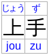

# Ruby Text-to-speech Explainer

This document is a draft, and does not claim to represent the consensus of any particular group.

[Feedback](https://github.com/w3c/html-ruby/issues) welcome.


## Authors

* Florian Rivoal

The proposal and supportive arguments in this document are based on a long and rich history
of discussions in and around the W3C Internationalization Working Group and Interest Group.
Many thanks to all who have contributed to this topic over the years.


## Context

Ruby, a form of interlinear annotation, are short runs of text alongside the base text.
They are typically used in East Asian documents to indicate pronunciation or to provide a short annotation.

<figure>
    
</figure>

Ruby as a phonetic indication can be used for a variety of reasons.
The most typical case is indicating the normal pronunciation of words
for the benefit or readers who might not know them:
children still learning to read,
people with learning disabilities,
non-native speakers…
A related but distinct practice is to indicate
unusual readings of words
which the reader may be unfamiliar with
or could not guess from context,
even if they are proficient readers.

Also, even if phonetic ruby is the most common case,
there are also other uses.
Sometimes, ruby is used to to give non-phonetic supplemental information:
a mnemonic atop of phone number,
dates of birth and death atop a person's name in a history book,
a translation into a different language,
a pun or other word-play,
or any other sort of thing that might seem appropriate in an interlinear annotation.

While the questions of how to markup ruby
and how to visually lay it out
are already well addressed by specifications
(see <cite>[HTML Ruby Markup Extensions](https://www.w3.org/TR/html-ruby-extensions/)</cite> and <cite>[CSS Ruby Annotation Layout Module Level 1](https://www.w3.org/TR/css-ruby-1/)</cite>,
how ruby should be presented through text-to-speech has not been well tended to so far.
This explainer attempts to give a brief introduction to why that is a problem,
and a potential solution.

> Note: More different patterns of ruby usage,
> with a focus on Japanese,
> are discussed in <cite>[Text to Speech of Electronic Documents Containing Ruby: User Requirements](https://w3c.github.io/ruby-t2s-req/)</cite>.
> With thanks to its author, this explainer borrows some examples from that document.

In the context of this document,
the term “<dfn>speech user agent</dfn>” will used to refer without distinction
to either the combination of a visual user agent with a screen-reader,
or to an audio-only user-agent.


## Problem

### Single or Double Reading?

To the extent that the ruby annotation contains additional information to that contained in the base,
users of the document have as much use for that information
whether they are looking at a visual rendering
or are listening to a text-to-speech representation of the document.
In some cases, missing that information could even lead to misunderstandings
(e.g. `<ruby>敵<rt>とも</ruby>` suggesting “frenemy” becomes just “friend” or “enemy”
if either the base or annotation is excluded).

On the other hand,
if the ruby annotation contains phonetic information,
the expectation is that the annotated word will be read correctly,
not that it would be read twice.
Double reading is at least distracting,
and occasionally that too can even be a source of confusion or misunderstandings.

Consider the following example:
`My name is <ruby>Knaught<rt>not</ruby>`.
If the ruby base and annotations were both read,
this would sound as if the speaker was denying their name instead of announcing it.

It is therefore important to readers of a document
that speech user agents correctly determine
whether to read both the base and the annotation separately,
or whether to provide a single reading.
Existing HTML ruby markup does not distinguish,
leading annoyances, confusion, and misunderstandings
for text-to-speech readers of ruby-annotated documents.


### Which Single Reading?

When there should be a single phonetic reading,
what should it be?

Ruby is primarily used in East-Asian languages
whose writing system uses ideographic characters
which represent the meaning,
but not the sound of the text.
This is a key reason why phonetic ruby annotations are used:
to help readers who do not otherwise know for sure how some characters are pronounced.
It may therefore seem that reading the annotation when it is phonetic is the correct answer,
but this can in fact be insufficient.

* A few Japanese phonetic characters have several possible readings.
  For instance, は is typically read as “ha” when it is part of a longer word,
  but is read as “wa” when it is a grammatical particle.
  The presence of ideographs in the text makes it generally unambiguous.
  `<ruby>母<rt>はは</ruby>は<ruby>知<rt>し</ruby>っている`
  is read “haha wa shitteiru” and means “My mother knows.”
  However, if working from the annotation alone,
  the user agent would be faced with “はははしっている”,
  which it might interpret correctly,
  but may also read literally as “hahaha sitteiru” (Ha Ha Ha! I Know),
  or the rather bizarre “ha wa hashitteiru” (The tooth is running).

* Even though many Japanese speakers are not consciously aware of it,
  pitch accent has phonemic value in Japanese,
  and may distinguish between words that would otherwise be homophones.
  Context is often helpful, but not always sufficient.
  “あえがすき” (ame ga suki) could mean “I like rain” or “I like candy”.
  The pronunciation is <em>not</em> identical:
  “rain” (雨 in ideographs) is “ame” with a falling pitch,
  “candy” (飴 in ideographs) is “ame” with a rising pitch.
  However, Japanese phonetic characters (hiragana and katakana) cannot distinguish between the two,
  and a speech user agent reading purely from annotation could guess incorrectly
  and confuse the reader.

* In Chinese, while the alphabetic phonetic notation (pinyin) can include tone markings,
  they are frequently omitted.
  If such tone-less pinyin is used as ruby annotation,
  the phonetic annotation is not wrong,
  but it is incomplete.
  It can be helpful to the reader,
  and is insufficient to know exactly how to pronounce the text correctly.

  For example, these two pairs of sentences,
  whose meaning is clear in the base text,
  are only distinguished phonetically by tones,
  which are missing in this transcription:
  <ruby>我<rt>wo</rt>买<rt>mai</rt>了<rt>le</rt>一<rt>yi</rt>本<rt>ben</rt>书<rt>shu</ruby> (I bought a book), vs
  <ruby>我<rt>wo</rt>卖<rt>mai</rt>了<rt>le</rt>一<rt>yi</rt>本<rt>ben</rt>书<rt>shu</ruby> (I sold a book);
  <ruby>我<rt>wo</rt>想<rt>xiang</rt>问<rt>wen</rt>你<rt>ni</ruby> (I want to ask you [a question]), vs
  <ruby>我<rt>wo</rt>想<rt>xiang</rt>吻<rt>wen</rt>你<rt>ni</ruby> (I want to kiss you).
  If a user agent is generating its speech only from the annotation,
  it may pick a reading other than the one intended.

  Arguably,
  unlike the previous two cases,
  this is a problem the author could solve by including tone markings
  (mǎi vs mài, wèn vs wěn),
  but inputting them can be tedious and is often skipped.

In all the examples above,
any reasonable text-to-speech engine would have been able to generate the correct pronunciation
unambiguously from the base text alone,
thanks to the pronunciation dictionaries they embed.

However, that is not always the case:
some characters or even character combinations
can have multiple possible pronunciations.
This is especially frequent in Japanese.
This can often be disambiguated by context,
but not always.

* 生命, which means life, is usually pronounced seimei,
  but also occasionally be read inochi,
  which conveys a different nuance.
  This cannot be guessed by context,
  and would be indicated through ruby.

* There are many family names, given names, or place names,
  where the same ideograph sequence can have multiple possible readings.
  As these are proper nouns,
  only one reading is appropriate in any given circumstance,
  but which one cannot be known from the ideographs alone.
  吉川, a family name, can be Yoshikawa or Kikkawa;
  一郎, a given name, can be Ichirō or Kazuo…

* Names written in ideographs can occasionally be assigned non-standard readings through ruby,
  replacing the standard reading(s) that the reader would other otherwise have assumed.

Therefore, attempting to determine pronunciation only from the base text
is not fully reliable either.

However, the speech user agent can derive information from both parts,
and provide a rendering that is better than what could be achieved from either part alone:
* If the reading indicated by the annotation
  <em>does</em> correspond to one of the possible pronunciations
  recorded in the text-to-speech engine's dictionary,
  then that dictionary entry can provide additional phonetic information
  such as vowel length, pitch accent or tones,
  and should be used.
* If the reading indicated by the annotation
  <em>does not</em> correspond to any known pronunciation of the base text,
  the annotation alone should be read.
  However, this is only appropriate
  if the speech user agent knows
  that it is dealing with a ruby annotation representing pronunciation.
  Otherwise, the appropriate treatment would be
  to read both the base and the annotation separately.


## Proposal

### The `ruby-type` Attribute

We propose to add a `ruby-type` attribute to HTML.
Its role is to determine who ruby-annotated text is to be rendered as audio
by speech user agents.

Its values are:
* `complementary`: indicates that the ruby annotations convey information that is complementary or supplemental to the base text.
  A speech user agent must convey both the base text and the ruby annotation separately to the user,
  in document order.

  As an exception,
  if the audio rendering of the base and the annotation would be strictly identical,
  a speech user agent must convey it once, not repeat it.

  > Issue: the word complementary is a little long, and occasionally mistyped as complimentary.
  > Suggestion for a better keyword are welcome.
* `phonetic`: indicates that the ruby annotation is a phonetic representation of the corresponding base text.
  A speech user agent must not convey the base text and the ruby annotation separately,
  and must instead produce a single audio rendition.
  To the extent possible, it should derive the pronunciation from information contained in both the base and the annotation.

  A typical patter would be to use the (possibly incomplete) phonetic representation in the annotation
  to select one of several fully characterized phonetic renderings stored in the user agent’s dictionary.

  If the speech user agent cannot reconcile the pronunciation of the base and of the annotation,
  (i.e. the only known possible pronunciation of the base contradicts the only known pronunciation of the annotation),
  the pronunciation must be based on the annotation.

  Note: An actual spec could go into further details
  on how to arrive at a single pronunciation from multiple sources,
  thought this would likely need to remain informative guidance,
  or as "should" rather than "must" requirements.

* `auto`: the default state, assumed if the attribute is omitted.
  A speech user agents must attempt to automatically determine
  whether to behave as `complementary` or as `phonetic`:
  if it can determine
  that the ruby annotation is a possible pronunciation
  of the corresponding ruby base,
  it should behave as `phonetic`;
  if it can determine that it is not,
  or if it cannot be sure either way,
  it should behave as `complementary`.

In all cases, it is understood that the above requirements
describe the default behavior speech user agents.
It is always acceptable to enable users to opt into alternative behaviors
via a variety of settings,
(e.g. A person Bilingual in Chinese and Japanese but more familiar with Chinese culture
might like a setting to read all Chinese names in Chinese, even if they have Japanese phonetic ruby).

See also [Alternatives Considered / Additional Values](#additional-values) for discussion of potential additional values not currently retained by this proposal.


### Propagation

In most cases, the vast majority of uses of ruby in a page call for the same `ruby-type`.
Having to specify the attribute on every distinct instance of ruby in the page would be tedious and redundant.
Instead, we propose that the `ruby-type` attribute can be set on any HTML element
that can contain [phrasing content](https://html.spec.whatwg.org/multipage/dom.html#phrasing-content-2),
and any ruby element which does not itself has a `ruby-type` attribute looks up the tree
and determines its mode based on the value from the nearest ancestor that does have one,
or `auto` if there is no such ancestor.

> Example:
> The following two documents snippets have identical semantics:
>
> ```html
> <body>
>   I rode the <ruby ruby-type=phonetic>新幹線<rt>shinkansen</ruby>
>   from <ruby ruby-type=phonetic>東京<rt>Tokyo</ruby>
>   to <ruby ruby-type=phonetic>京都<rt>Kyoto</ruby>.
>   It was really <ruby ruby-type=complementary>fast<rt>300 km/h</ruby>.
> </body>
> ```
> ```html
> <body ruby-type=phonetic>
>   I rode the <ruby>新幹線<rt>shinkansen</ruby>
>   from <ruby>東京<rt>Tokyo</ruby>
>   to <ruby>京都<rt>Kyoto</ruby>.
>   It was really <ruby ruby-type=complementary>fast<rt>300 km/h</ruby>.
> </body>
> ```
> 
> The expected audio rendition would sound like:
> “I rode the shinkansen from Tokyo to Kyoto. It was really fast (300 km/h).”

The explicit `auto` value allows authors to reset `ruby-type` to its default state
for entire subtrees.


### Multi-level Ruby

Although a single annotation per piece of base text is most common,
occasionally multiple layers of ruby annotation are attached to the same word or phrase.
This could be in order to give multiple transcriptions of the phonetic guidance like

or

It could be in order to have both phonetic ruby and complementary information
attached to the same base like

or even be about attaching multiple independent pieces of complementary information.

This can be achieved via different markup techniques,
from nesting `<ruby>` elements
to specialized uses of the `<rt>` or `<rtc>` ruby sub-elements.

In any case, this means different annotations on the same base text
may have different roles, 
which need to be distinguished for the purposes of text-to-speech.

We propose that this can be addressed by defining that
the state of the `ruby-type` attribute on the element carrying the annotation
is what determines whether both the annotation(s) and base are to be read separately,
or or combined into a single reading.
As with [Propagation](#propagation),
if the `ruby-type` attribute is not set directly on the annotation,
the speech user agent would refer to the closest ancestor that does have such an attribute,
which could be the `<ruby>` element,
or some container ancestor.

Generalizing from [the earlier description](#the-ruby-type-attribute):
* any annotation with `ruby-type=complementary` must be read separately,
  in addition to the base text, and in document order.
* all annotations with `ruby-type=phonetic` must contribute to a single unified
  pronunciation of the base text, and must not be read individually.
  If the annotations and the base disagree,
  the annotations take precedence.
  If the annotations disagree with eachother,
  the choice is somewhat arbitray,
  but we propose that the outermost annotation takes precedence.
* if multiple annotations on the same base have `ruby-type=auto`,
  we propose to let the user agent decide for itself which is which.

  > Issue: It could be useful to authors
  > to be able to predict the user agent's behavior,
  > so we could specify a particular approach,
  > such as innermost annotation being treated as `ruby-type=phonetic`,
  > and all others being treated as `ruby^type=complementary`.
  > This could however result it worse results
  > than what the user agent could have determined on its own.
  

### Influence on the Pronunciation of Non-annotated Text

* Ruby annotations marked with `ruby-type=complementary` MUST NOT have any effect
  on the pronunciation of any other individual word in the same document.
  All un-annotated text should be read is it would be had they not been present,
  although prosody may be influenced,
  similarly to how it would be had the annotation been inserted as an inline parenthetical.

* Morphological or contextual analysis is often used to deterine the correct
  pronunciation of text based on its surronding,
  including un-annotated text.
  As substituting the annotation for the base or concatenating both
  could confuse the analysis,
  speech user agents supplying raw text as context to morphological analysis
  should use the base text in such cases.

  > Example: the un-annotated は in “<ruby>母<rt>はは</ruby>は”
  > is unambiguously to be read as WA, not HA.
  > However, if the morphological analysis engine
  > was supplied with “ははは” (or “母ははは”) rather than “母は”,
  > it may fail to make the correct determination.

* It is reasonably common that names with an unusual reading
  will have their pronunciation indicated with ruby
  when first encountered within the text,
  but not repeated later.
 
  It would therefore seem useful to set the expectation that
  speech user agents should remember the given pronunciation
  for any word annotated by `ruby-type=phonetic`,
  and reuse it on later instances of the same word which lacks annotations.
  Not doing so risks causing confusion,
  as the same name could be read aloud differently,
  making it sound like they're two different names.
 
  However, this may not always be doable,
  at least not as a strict "must do" rule:
  words other than names can also have multiple readings,
  and those may validly varry within a single document,
  based on context.
  For instance, “開く”, which means “to open”,
  may be read as “aku” or as “hiraku”
  depending on whether it is used as a transitive or intransitive verb,
  and depending idiomatic usage for the thing that is being opened.

  > Issue: How do we solve this?
  > Options include:
  > 1. `ruby-type=phonetic` <em>adds</em> a reading for the annotated word
  >    in the ua's pronunciation dictionary to be used on later unannotated words,
  >    but the UA is still expected to perform morphological and contextual analysis
  >    to pick the right reading.
  >    Seem appropriate and flexible,
  >    but not necessarily dependable.
  > 2. create a new `ruby-type=phonetic-dfn`
  >    which has the same effect as `phonetic` <em>inside</em> a ruby element,
  >    but also instructs the speech user agent to systematically
  >    use that pronunciation in later instances of the same word
  >    unless explicitly overridden.
  >    Would avoid mismatches,
  >    but seems tedious for authors to use,
  >    and possibly overkill if option i would work reliably.
  > 3. Same behavior as option ii,
  >    but instead of basing it on an additional value of `ruby-type`,
  >    base it on the a markup pattern composed of existing HTML features, like:
  >    ```html
  >    <ruby ruby-type=phonetic><dfn>…</dfn><rt>…</ruby>
  >    ```


## Alternatives considered

### Additional values

The following additional or alternative values have been suggested for the `ruby-type` property.
The current proposal does not include them,
but further discussion could change that.

#### `phonetic-optional` vs `phonetic-required`

As discussed in the introduction,
phonetic ruby annotations can exist for a variety of reasons,
and it was [suggested](https://github.com/w3c/html-ruby/issues/24#issue-2605911323) that it may be useful
to distinguish readings that must be taken into account for the document to make sense,
from those that are merely optional conveniences to readers.

However, it is not clear that speech user agents would process these values differently:
in any case, words with phonetic annotations need to be read once,
and need to be read correctly.

Moreover whether something is a necessity or a convenience is not something the author can reliably judge.
If the speech user agent, without the annotation, would read the word incorrectly,
then the annotation is necessary.
But whether that will be the case depends
on the quality of the user agent's dictionaries and language analysis,
which is not something the author can predict.

Whether a sighted reader would know how to pronounce the word without the annotation
varies enormounsly depending on the reader,
and is not something the author can predict.
Even uncomon readings may be known to a reader who is familiar with the subject matter,
and the level of annotation needed while learning to read varies enormously,
even over the course of a school year,
or depending on the text book used.
In any case, these variations in needs may influence the desire for variation
on the visual presentation of phonetic ruby,
but the audio rendering,
which is what `ruby-type` is about,
is always expected to be the same: read once, correctly.

#### `alternate`

It [has been suggested](https://github.com/w3c/html-ruby/issues/24#issuecomment-3522331155)
that an additional `alternate` value could be useful,
When the annotation is neither phonetic nor complementary information,
but rather conveys the same information as the base,
albeit in a different (visual) form.

This could for instance be used when the base and annotation
represent the same word in different scripts.

However, it is unclear whether this value adds a usefully distinct behavior.
If both scripts represent the same language,
it is not clear how this value is usefully different from `phonetic`;
and if they represent different languages and are pronounced differently,
even if the words are strict synonyms, 
they do contain some degree of complementary information (of a linguistic nature),
which users of the document may want to know just as much
regardless of whether they are looking at a visual rendering
or are listening to a text-to-speech representation of the document.


### Full automation

While historically, speech user agents have been insufficiently sofisticated
to reliably provide the correct reading for ruby without author gudiance,
it could be hoped that with improvements in text-to-speech dictionaries,
and with improvements in context-aware heuristics,
this problemm could be solved
without any need for authors to annotate their ruby content in any way,
as user agents automatically and correctly determine
whether any given ruby annotation is phonetic or complementary.

While it is true that such advances are increasing the success-rate of guessing correctly,
they can never be fully reliable:
* No dictionary can possibly cover all proper nouns.
  Place names and people names are not only a common source of rare ideographs
  whose readings might not be well known even to a machine,
  but more importantly,
  even names composed of common ideographs have uncomon or unique readings on occasion,
  for a variety of reasons:
  dialectal variations,
  outdated readings,
  creative naming by parents, 
  little-known places,
  works of fiction…

  If a user agent runs into an annotation
  whose pronunciation does not match any known possible reading for the corresponding base,
  it cannot reliably determine
  if the annotation is complementary information,
  or if it is simply a phonetic reading not covered by its dictionary.
* Ruby can be used cross-linguistically:
  for instance, a Japanese news paper may be discussing events in Hong-Kong.
  Not only, as discussed above,
  is it impossible to have an exhaustive dictionary of Japanese pronunciation of all Japanese proper nouns,
  the task becomes even more challenging
  if we consider also needing a Japnese dictionary of all Chinese names…
* Ruby can be just as useful in minority or regional languages,
  for which comprehensive dictionaries or contextal analysis systems do not always exist.
* Not all user agents run on high-end devices with unlimited storage for comprehensive dictionaries,
  especially given that dictionaries in multiple languages may be needed.

Arguably, if we assume a user agent with <abbr title="Artificial General Intelligence">AGI</abbr> capabilities,
with full understanding of the text, the context, the culture in which it was produced,
and even a good sense of humor to understand ruby-based puns,
maybe this could indeed be fully automated.
But at this point, this is science fiction,
and if we do get there,
the relevance of HTML itself and the nature of user agents
becomes an open question.


### A Different Kind of Attribute

#### What vs Why

Instead of an attribute describing directly what is expected to be done by the speech user agent
with the ruby annotation,
we could consider having an attribute categorizing the various reasons
why ruby gets used
(e.g. translation, commentary, phonetic guidance, non-standard pronunciation, additional info, play-on-word, dramatic effect…)
so that the speech user agent can do something smart tailored to each of these use cases.
However, establishing the list of possible uses is very subjective,
and they still need to be mapped to some kind of behavior.
If the mapping and the behaviors are non standard,
there would be very little authors could rely on.
Moreover, it does seem that all uses of ruby are adequately served by either
"it's extra information, read both", or "it's phonetics, read the whole thing once, properly".

#### `base`, `annotation`, and `both` as Values

The attribute (possibly named `ruby-tts`, `ruby-reading`, `ruby-type`…) would indicate
which part of of the ruby element is read aloud by the speech user agent:
the `base`, the `annotation`, or `both`.
In this suggestion, `both` means reading the both the base and the annotation separately.

The downsides of this proposal are:
* `base` as a value is not terribly useful, and arguably a foot-gun.
   If an annotation is present, it generally conveys something,
   and hiding that from the user is likely unwise.
   More over, in exceptional cases,
   if there really is a need,
   this can already be acheived by adding `aria-hidden` on the annotation.
* Although it could seems that `annotation` would be the right value to reach for
  in the case of phonetic annotations, 
  it overlooks the fact,
  discussed in [Which Single Reading?](#which-single-reading)
  that annotation can be correct yet incomplete,
  and that the full information is often to be found
  in the combination of the annotation and the base.


### Using ARIA

Trying to use existing tools to solve this problem,
one could consider that both the base and the annotation are always to be read sequentially,
unless the base uses `aria-labeledby` to point to its annotation,
in which case only the annotation would be read.
However:
* this fails to take advantage of the fact that
  the relationship between the base and the label is already know,
  and requires an obnoxious amount of redundant markup,
  including an `id` on every ruby annotation.
* This does not address the fact
  discussed in [Which Single Reading?](#which-single-reading)
  that annotation can be correct yet incomplete,
  and that the full information is often to be found
  in the combination of the annotation and the base.
